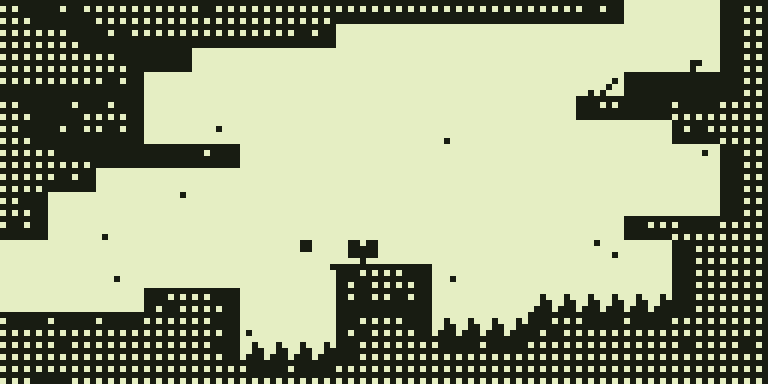

# Celeste Classic for Flipper Zero

Celeste Classic (the original PICO-8 game), using [ccleste](https://github.com/lemon32767/ccleste), adapted for stock Flipper Zero hardware running **Momentum mntm-012 / API 87.1**. No expansion module is required.

## iPhone

A native iPhone version with a full-colour square display, compact eight-direction touch pad, haptics, audio, room checkpoints and lifetime statistics is in [`ios/`](ios/README.md).

## Install

Download the release ZIP and copy the **contents of `sdcard/`** to the Flipper's microSD card with qFlipper. This places:

- `apps/Games/celeste_classic.fap` — the standalone Flipper game.
- `apps_data/celeste_classic/Celeste-Windows.exe` — optional Windows portable helper, required for the Windows Open button.

You can omit the EXE for Flipper-only play. Start **Games → Celeste Classic**.

## Controls and graphics

- Arrows: move and aim; **OK: jump; Back: dash**.
- Hold Back: pause/settings. The menu stays open while Back remains held; release it and tap Back to resume. Because dash responds immediately, this hold dashes first; pause from a safe position.
- **Open on computer** is the first settings item. Its submenu offers Windows automatic launch and Mac/Linux manual USB modes.
- Restart run requires an in-game confirmation and preserves lifetime berries, deaths, summits, restarts, and highest room.
- Follow view shows a native 128×64 window into the 128×128 room. Madeline retains the original 8×8 sprite geometry and animation frames, with a white face and solid jacket/boots. Vertical scrolling uses a tight two-pixel dead zone, smooth following and room-edge clamps; physics are unchanged. Optional Overview shows the whole room at 64×64. Decorative scenery is removed and stone uses stable spatial patterns, without temporal dithering.
- Timer, altitude, memorial, credits and summit text stay inside the screen on opaque white panels, independent of scrolling.
- Music is a simplified monophonic arrangement of cartridge patterns plus effects through Momentum notifications; the firmware's volume/mute applies. The speaker cannot reproduce the original four-channel sound.

## Saves and Dolphin XP

Checkpoints save the current room, collected berries, deaths, double-dash ability and completion status. Reopening starts at that room's entrance, not the exact mid-air position. Two alternating checksummed SD files preserve the previous valid save if a write fails. `SAVE ERROR` means the latest progress is not yet durable; use **Save + exit** to retry. Restarting does not erase lifetime statistics. Original run time is not persisted.

A saved strawberry awards **1 Dolphin XP**, a saved first summit in a run **10 XP**. Reopening a completed save does not award again. Momentum's ordinary game deeds have zero weight, so this port isolates its exported `DolphinDeedTestRight` compatibility path in `xp.c`. That API also resets Dolphin's bad mood; awards stop at a pending level-up. It is Momentum-specific, not a promise for official firmware. A power cut between saving the achievement and awarding XP can lose that award; saving first prevents reward duplication after reload.

## Windows: open directly from Flipper

1. Connect the Flipper by USB to your own **unlocked Windows desktop with US English keyboard layout**. Close qFlipper so it releases the serial port.
2. Pause the game, select **Open on computer → Windows: open**.
3. Flipper briefly acts as a keyboard: Win+R opens PowerShell, then a visible bootstrap reads the helper from Flipper's SD over USB serial. Its SHA-256 is checked against the hash built into the FAP.
4. The temporary native helper opens your **default browser** to a loopback-only page. There is no Web Serial permission prompt, account, installation, or Internet request. Game simulation, music and saves remain on Flipper; the computer supplies keys and a full-colour 128×128 display.
5. **Close session** stops the helper. PowerShell waits for it and removes only its uniquely named temporary directory. The SD copy remains. A crash or power loss can leave that temporary copy; no background cleanup service is installed.

This types commands into the foreground desktop. Do not use the Windows option on macOS/Linux, a locked session, a non-US keyboard layout, or while another task owns the foreground. Endpoint security, execution restrictions, USB policies or a slow-opening console can prevent launch; no policy bypass is attempted. Windows HID/USB launch is **built but not tested on a physical Windows/Flipper pair**.

The browser renders only the original PICO-8 game, not commercial Celeste (2018). The portable page exposes the requested Catppuccin/Sand appearance palettes and a clock-based schedule; it does not claim astronomical sunrise detection.

## Windows Defender report

A user reported Wacatac blocking `Celeste-Windows.exe` when copying it to SD. The exact released file passed a Microsoft Defender custom scan on a fresh Windows runner on 2026-09-24 with updated security intelligence **1.459.378.0**, engine **1.1.26080.3**. The helper has not been changed to alter its detection. This result does not establish that the user's machine will now accept it, or validate runtime behavior. [Scan evidence and scope](docs/DEFENDER.md).

Keep Defender enabled. When back at the computer, use **Windows Security → Virus & threat protection → Protection updates → Check for updates**, then download and scan the file again. If it is still blocked, leave it quarantined and use the standalone FAP while the exact detection is reviewed. Do not add an exclusion or disable protection. Microsoft's [file submission portal](https://www.microsoft.com/en-us/wdsi/filesubmission) handles suspected incorrect detections.

## Separate permanent Windows game

The portable page has **Install separate game**. It installs the upstream native **ccleste v1.4.0** release into `%LOCALAPPDATA%\Programs\CelesteClassic` and adds a Start-menu shortcut, without administrator access. It is independent of Flipper and uses its own files and saves. No Flipper save is imported or synchronized. Existing unknown installations are not overwritten.

The installed game's controls follow upstream: arrows move, Z/C jump, X/V dash, Escape pause, **Shift+S save / Shift+D load**. Launch its Start-menu shortcut after installing. The embedded official release is checksum-verified; see `THIRD_PARTY.md`.

## Mac and Linux

Automatic keyboard-driven launch is Windows-only. Manual Mac (Apple Silicon/Intel) and Linux x86-64 helpers are in the release. Select the matching **manual USB** option on Flipper, then run that platform's helper. They use the default browser and do not request Web Serial access. macOS may require trusting the unsigned helper; Linux may require serial-device permission. Those OS checks are not bypassed. Permanent native installation is Windows-only.

An optional `celeste_portable.img` contains manual launchers for Momentum's **USB Mass Storage** app. Copy the image to SD, mount it in that app, and copy the matching launcher to the computer **before closing Mass Storage and starting Celeste**. Do not run a file from a drive that will be disconnected while switching USB modes. Windows automatic launch instead transfers its own temporary copy and needs no disk image.

## Validation

- FAP compiles and passes imported-symbol checks against the released Momentum mntm-012 SDK.
- Actual C core/renderer host tests cover all 31 rooms, movement/jump/dash, deaths, checkpoint reconstruction, completion deduplication, lifetime statistics and corrupt-save rejection.
- Renderer tests cover every player animation/direction, native pixel geometry, camera edges/room changes/death/freeze, and text visibility in both views.
- Native installer tests validate extraction and reject unsafe archive paths.
- ARM build is not a physical-device test. Full Flipper firmware emulation was not set up: the available route requires a patched emulator toolchain. Host captures below show the actual game renderer, not a physical LCD.
- Physical button feel, speaker output, USB/HID launch, Windows installer execution, and device performance still require hardware checks. See `docs/ACCEPTANCE.md`.



## Build

`python3 -m venv .venv && .venv/bin/pip install ufbt pillow`

Download the [mntm-012 SDK](https://github.com/Next-Flip/Momentum-Firmware/releases/tag/mntm-012), then:

```
.venv/bin/ufbt update --hw-target f7 --local /path/to/flipper-z-f7-sdk-mntm-012.zip
python3 scripts/build_portable.py
.venv/bin/ufbt
.venv/bin/python tests/test_core.py
.venv/bin/python tests/test_render.py
.venv/bin/python tests/test_pause_input.py
python3 tests/test_portable_disk.py
```

The portable build requires Go and a macOS C compiler for Mac builds. `--windows-only` builds just the Windows helper and its FAP hash header on any Go-capable host. Build the helper **before** the FAP so its expected hash matches. `scripts/package.py` assembles the exact SD layout, manual helpers, checksums and release ZIP. Download sizes are recorded in `dist/SIZES.txt`.

Original work and third-party attribution: `THIRD_PARTY.md`. This is an unofficial fan port.
